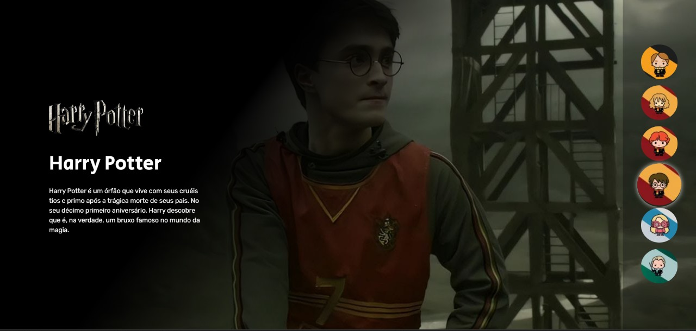

<h1>
    Projeto Harry Potter
</h1>

## 🛠 Tecnologias

As seguintes ferramentas foram usadas na construção do projeto:

- **[HTML](https://html.com/)**
  
- **[CSS](https://www.w3.org/Style/CSS/Overview.en.html)**
  
- **[JavaScript](https://developer.mozilla.org/en-US/docs/Web/JavaScript)**
  

## Links

<ul>
    <li>
        <a href="https://odilonenrique.github.io/Harry-Potter/">Deploy</a>
    </li>
</ul>